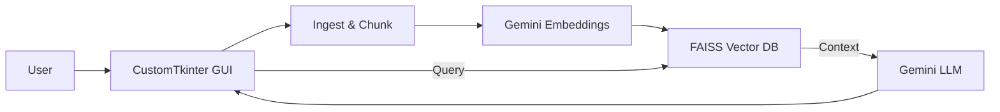

# AIBO — Personal RAG Desktop Assistant

AIBO เป็นแอป Desktop ขนาดเล็กที่อ่านไฟล์ PDF / TXT แล้วตอบคำถามจากเอกสาร โดยใช้
Google Gemini (LLM + Embeddings) ร่วมกับ FAISS เพื่อเก็บเวกเตอร์บนเครื่อง

---

## Quick overview
- นำเข้าไฟล์ PDF / TXT ไปที่ `my_documents/`
- ระบบจะแบ่งข้อความเป็นชิ้น (chunking) และสร้าง embeddings
- เก็บ embeddings ใน `vector_db/` ด้วย FAISS
- พิมพ์คำถามใน GUI เพื่อให้ระบบค้นและตอบจากเอกสาร



---

## Prerequisites
- Python 3.10+ (แนะนำ 3.12)
- Google Gemini API key

---

## Quick install
1. สร้างและเปิดใช้งาน virtual environment:

```bash
python -m venv .venv
.\.venv\Scripts\activate   # Windows
source .venv/bin/activate    # macOS / Linux
```

2. ติดตั้ง dependencies:

```bash
pip install -r requirements.txt
```

3. รันแอป:

```bash
python app.py
```

---

## Usage (สั้น ๆ)
- ใส่ `GOOGLE_API_KEY` ในหน้าแรกของแอป หรือบันทึกลงไฟล์ `.env`
- กด `นำเข้าเอกสารใหม่` เพื่อสร้างฐานข้อมูลเวกเตอร์
- พิมพ์คำถาม แล้วรอคำตอบจาก AIBO

---

## Project structure
```
.
├─ app.py
├─ requirements.txt
├─ my_documents/    # วาง PDF / TXT ที่ต้องการให้ระบบอ่าน
├─ vector_db/       # FAISS DB (สร้างเมื่อทำการ ingest)
└─ .env             # GOOGLE_API_KEY=...
```

---

ถ้าต้องการ ผมช่วยเพิ่มภาพหน้าจอ ตัวอย่างการใช้งาน หรือเวอร์ชันภาษาอังกฤษให้ได้ครับ
